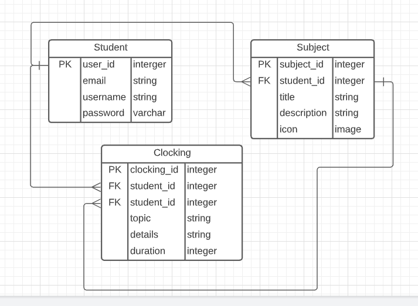

# Ruby on Rails Group our transactions app

> This application helps students clock in their studies based on their subjects. They can track the number of hours they spend studying a specific subject.
> The app allows students to clock in their non-academic activities as well.
> Students can create many subjects as well as many clockings.
> They can create many clockings per subject.

## Entity Relationship Diagram

## Built With

- Ruby
- Ruby on Rails
- PostgreSQL
- Devise
- Bootstrap
- HTML
- CSS

### Tested With

- Ruby gem RSpec
- Ruby gem shoulda Matchers
- Ruby gem capybara

## FRONT END

Open [Frontend Code](https://github.com/BigWizzo/Study-Mate)

### Prerequisites

- Ruby: 3.0.2
- Rails: 6.1.4
- Postgres: >=10
- Yarn

## Getting Started

To get a local copy up and running follow these simple example steps.

### Setup

- Open the console
- Download or git clone https://github.com/BigWizzo/Study-Mate-API.git
- cd RoR-Capstone
- run `bundle install`
- run `yarn install`
- run `rails server`
- run `rails db:create`
- run `rails db:migrate`
- Open `http://localhost:3000/` in your browser.

### Run Tests

- run `bundle exec rspec`

### Deployment

- In the console
- run `heroku create`
- run `git push heroku main`
- run `heroku run rake db:migrate`
- run `heroku open` to open the application

## Authors

👤 **Will Nyamunokora**

- Github: [@bigwizzo](https://github.com/bigwizzo)
- Twitter: [@willnyamunokora](https://twitter.com/willnyamunokora)
- Linkedin: [@willnyamunokora](https://linkedin.com/in/willnyamunokora)

## 🤝 Contributing

Contributions, issues and feature requests are welcome!

Feel free to check the [issues page](https://github.com/BigWizzo/Study-Mate/issues).

## Show your support

Give a ⭐️ if you like this project!

## Acknowledgments

- Railsguides
- Microverse
- Stand up Team
- TSEs
- Web Cruch

## 📝 License

This project is [MIT](https://opensource.org/licenses/MIT) licensed.
